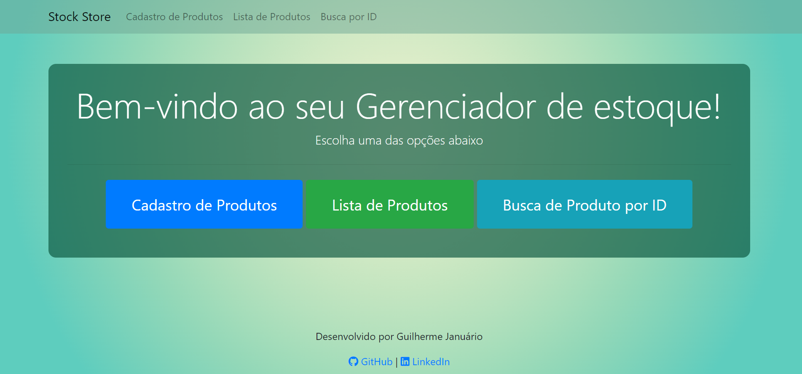
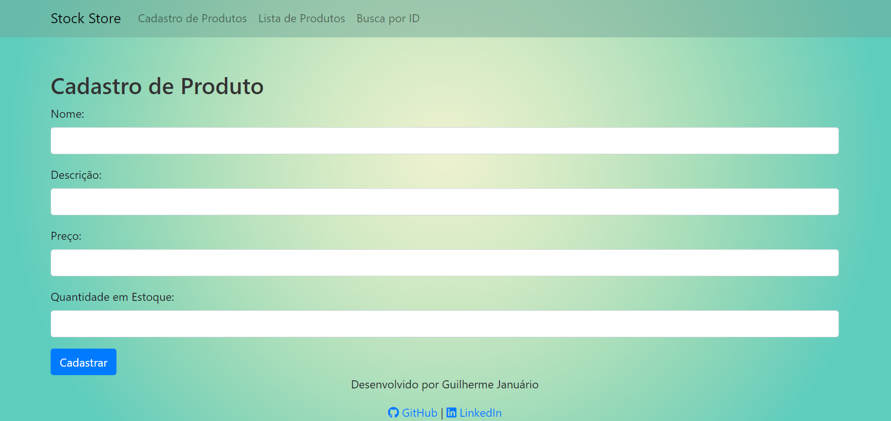
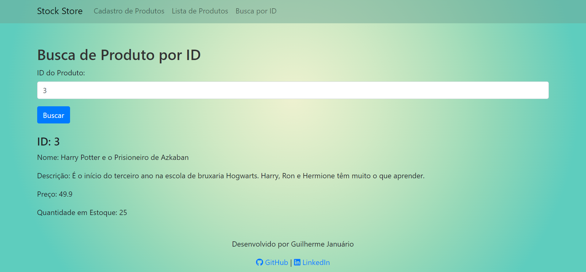

# :department_store: Store Stock  :department_store:

---

### 🔷 Resumo

<p>Criar uma aplicação Full Stack com Back e Front de cadastrado de estoque:
</p>

- Exibir todos produtos.
- Exibir um produto.
- Cadastro de produto.


## ⏯️ Como executar os Programas

- Você precisará ter o [JDK 17](https://www.oracle.com/java/technologies/downloads/#java17) instalado no seu computador;
- Baixe o repositório do projeto (com todos os algoritmos);
- Abra o terminal e navegue até o o arquivo FullStackStockApplication presente na pasta de exercício que você deseja executar;
- Compile o arquivo executando o comando `javac`, como mostra abaixo o exemplo executando o [Main](https://github.com/guiijanuario/StoreStock) :
```
javac Main.java
```
- Após compilar, execute o comando `java`, como mostra abaixo:
```
java Main.java
```

- Após abrir os arquivos da pasta resources com o VSCode, execute o arquivo `index.html`, com o `Live Server`, para rodar o front end.


## Front end






---

## 👨‍💻 Autor

Nome: Guilherme Januário <br>Linkedin: https://www.linkedin.com/in/guilherme-janu%C3%A1rio/

---

<h4 align=center>©️ Made with 💚 by <a href="https://github.com/guiijanuario">Guilherme Januário</a></h4>
